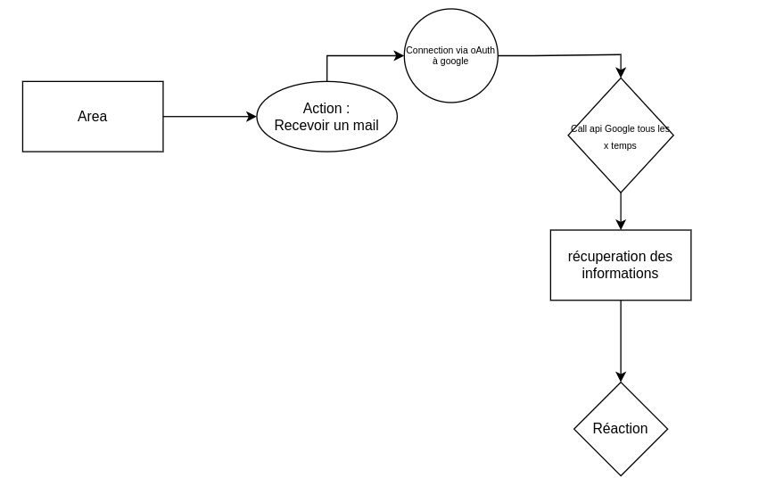

Details
========

Le projet est composer de plusieurs partie utile au bon fonctionnement du projet.

Authentification
-----------------

Nous avons mis en place un system d'Authentification sur notre projet.
Pour ce faire la personne doit renseigner uniquement un Username et un password associer.

C'est information sont stocker dans la base de donner et chaque utilisateur est associer à un token.

cela permet de personnaliser les action selon l'utilisteur.

.. _service:

Services
---------

:doc:`api`

.. _action:

Action 
-------

L'une des composantes les plus importante du projet sont les Actions.
cette dernière est une taches réaliser sur un service suivant des instruction déterminer en amont.

Voici un diagramme explicant de façons large le fonctionnement :

Pour ce faire une connection au service est necessaire ci-joint : :ref:`service`

.. _reaction:

Reaction
---------
